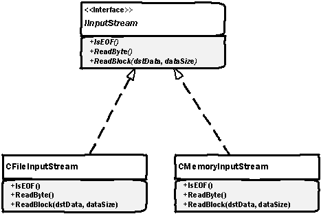
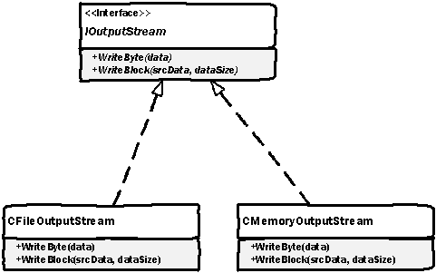


# Лабораторная работа №3. Паттерн «Декоратор»

- [Лабораторная работа №3. Паттерн «Декоратор»](#лабораторная-работа-3-паттерн-декоратор)
  - [Обязательные задания](#обязательные-задания)
    - [Задание 1 – Увеличить ассортимент напитков – 30 баллов](#задание-1--увеличить-ассортимент-напитков--30-баллов)
    - [Задание 2 – Увеличить ассортимент добавок к напиткам – 60 баллов](#задание-2--увеличить-ассортимент-добавок-к-напиткам--60-баллов)
  - [Дополнительные задания](#дополнительные-задания)
    - [Задание 3 – потоки данных – до 300 баллов](#задание-3--потоки-данных--до-300-баллов)
      - [Бонус в 150 баллов за разработку автоматических тестов для классов программы](#бонус-в-150-баллов-за-разработку-автоматических-тестов-для-классов-программы)

На оценку «удовлетворительно» необходимо набрать 80 баллов.

На оценку «хорошо» необходимо набрать 250 баллов.

На оценку «отлично» необходимо набрать 500 баллов.

**Дополнительные задания принимаются только после выполнения обязательных заданий.**

## Обязательные задания

### Задание 1 – Увеличить ассортимент напитков – 30 баллов

Изучив запросы клиентов, было принято увеличить ассортимент предлагаемых напитков:

- Ввести стандартную и двойную порцию латте. Двойная порция стоит 130 рублей, стандартная – 90.
- Ввести стандартную (80) и двойную (120р) порции капучино
- Предлагать покупателям 4 сорта чая (цена не зависит от сорта чая). Названия сортов выберите на свое усмотрение.
- Предлагать маленькую (50 р), среднюю (60р) и большую (80р) порции молочных коктейлей

Реализуйте в программе необходимые изменения.

Размер порции напитка, а также сорт чая влияет на описание напитка.

### Задание 2 – Увеличить ассортимент добавок к напиткам – 60 баллов

Добавьте следующие типы дополнений к напиткам

- Сливки (25р)
- Шоколад (10р за дольку, максимум: 5 долек)
- Ликер (2 типа – ореховый и шоколадный). 50 рублей вне зависимости от типа

Описание добавок должно включать в себя подробности, специфичные для добавки (количество долек шоколада и тип ликера).

## Дополнительные задания

### Задание 3 – потоки данных – до 300 баллов

Рассмотрите следующую иерархию наследования потоков ввода-вывода





Конкретные реализации классов потоков выполняют ввод-вывод в файл либо в память (контейнер вектор).

Необходимо при помощи паттерна «Декоратор» реализовать возможность динамически наделять потоки ввода/вывода следующим функционалом:

- Простое шифрование при записи и дешифрование при чтении. Используйте вариацию [шифра простой замены](https://ru.wikipedia.org/wiki/%D0%A8%D0%B8%D1%84%D1%80_%D0%BF%D1%80%D0%BE%D1%81%D1%82%D0%BE%D0%B9_%D0%B7%D0%B0%D0%BC%D0%B5%D0%BD%D1%8B), при которой каждый исходный байт преобразовывается в некоторый другой байт с использованием таблицы подстановки, генерируемой на основе передаваемого извне целочисленного ключа. Таблицу подстановки можно сгенерировать, перемешав  последовательность байт от 0 до 255 при помощи  алгоритма [shuffle](http://www.cplusplus.com/reference/algorithm/shuffle/). В качестве генератора псевдослучайных чисел рекомендуется взять генератор [mt19937](http://www.cplusplus.com/reference/random/mt19937/) из стандартной библиотеки. Придумайте, как, зная ключ шифрования, сгенерировать таблицу подстановки, выполняющую дешифрование.
- Компрессия данных при записи с последующей декомпрессией при чтении. Для компрессии и декомпрессии можете реализовать простейший RLE-алгоритм, который будет давать неплохие результаты на файлах с длинными повторяющимися последовательностями байт.

Разработайте с использование разработанных классов приложение командной строки, позволяющее преобразовать входной **двоичный** файл в выходной, выполнив при этом ряд манипуляций.

Синтаксис приложения командной строки:

```sh
transform [опции] <input-file> <output-file>
```

опции:

- `--encrypt <key>`. Добавляет шаг шифрования при записи с использованием ключа key. Опция может быть указана несколько раз, что позволяет выполнить несколько этапов шифрования.
  - `--decrypt <key>`. Добавляет шаг дешифрования при чтении с использованием ключа key. Опция может быть указана несколько раз, что позволяет выполнить несколько этапов дешифрования.
- `--compress`. Добавляет шаг компрессии при записи
- `--decompress`. Добавляет шаг декомпресии при чтении

**Пример**:

```sh
transform.exe --encrypt 3 --encrypt 100500 --compress input.dat output.dat
```

Выполняет преобразование Input.dat в output.dat, при котором входная последовательность в процессе записи шифруется ключом 3, затем ключом 100500, а затем подвергается компрессии.

```sh
transform.exe --decompress --decrypt 100500 --decrypt 3 output.dat input.dat.restored
```

выполняет преобразование содержимого файла output.dat в input.dat.restored, обратное предыдущей операции. В результате данной команды содержимое input.dat.restored  станет равным input.dat.

Объявление интерфейсов `IInputDataStream` и `IOutputDataStream` приводится ниже.

```cpp
class IOutputDataStream
{
public:
    // Записывает в поток данных байт
    // Выбрасывает исключение std::ios_base::failure в случае ошибки
    virtual void WriteByte(uint8_t data) = 0;

    // Записывает в поток блок данных размером size байт, 
    // располагающийся по адресу srcData,
    // В случае ошибки выбрасывает исключение std::ios_base::failure
    virtual void WriteBlock(const void* srcData, std::streamsize size) = 0;

    // Закрывает поток. Последующие операции записи выбрасывают std::logic_error
    virtual void Close() = 0;

    virtual ~IOutputDataStream() = default;
};

class IInputDataStream
{
public:

    // Возвращает признак достижения конца данных потока
    // Выбрасывает исключение std::ios_base::failure в случае ошибки
    virtual bool IsEOF()const = 0;

    // Считывает байт из потока. 
    // Выбрасывает исключение std::ios_base::failure в случае ошибки
    virtual uint8_t ReadByte() = 0;

    // Считывает из потока блок данных размером size байт, записывая его в память
    // по адресу dstBuffer
    // Возвращает количество реально прочитанных байт. Выбрасывает исключение в случае ошибки
    virtual std::streamsize ReadBlock(void * dstBuffer, std::streamsize size) = 0;

    virtual ~IInputDataStream() = default;
};
```

#### Бонус в 150 баллов за разработку автоматических тестов для классов программы

Бонус начисляется за разработку автоматических тестов для классов потоков и декораторов и разработку в TDD (либо BDD) стиле.
